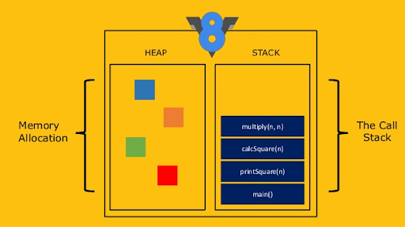
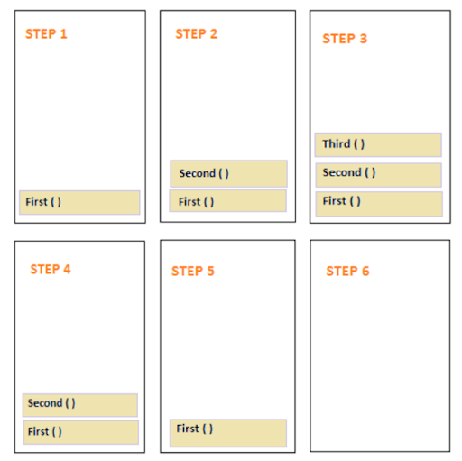
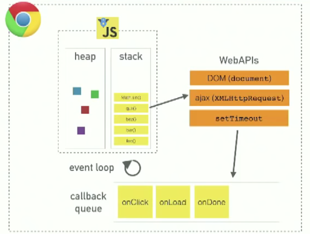
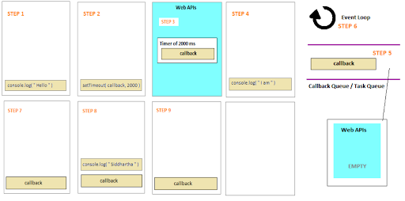

# Асинхронность в JavaScript
JavaScript - сихронный однопоточный язык программирования.

## Синхронный код
Синхронный код выполняется по порядку, один за другим. Это означает, что если одна операция занимает много времени, все остальные операции будут приостановлены до тех пор, пока эта операция не завершится.

```js
console.log(1);
console.log(2);
console.log(3);
```
> Вывод: 1, 2, 3

Движок JavaScript базируется на двух структурах данных:



- *Куча* (Heap) - не структурированный раздел памяти, который содержит в себе все используемые сущности
- *Стек* (Stack) - раздел памяти, работающий по принципу “последний зашёл - первый вышел”

> Функии работают в 2 этапа:
> 1. *Вызов функции* - функция добавляется в стек вызовов
> 2. *Выполнение функции* - функция выполняется и удаляется из стека вызовов

Пример:
```js
function Third(str) {
    return str + ' Morgan';
}

function Second() {
    return Third('Dexter');
}

function First() {
    const name = Second();
    console.log('My name is ' + name);
}

First();
```



> Стек вызовов (Call stack) работает по принципу “последний зашёл - первый вышел”. Поэтому, если функция `First` вызывает функцию `Second`, а функция `Second` вызывает функцию `Third`, то функция `Third` будет выполнена первой, а функция `First` - последней.

**Синхронный JavaScript**
1. Прост для восприятия
2. Легко читается
3. Легко отлаживается

**Почему лишь один поток?**
1. Просто и надёжно
2. Более экономно
3. Нет проблем с синхронизацией состояний
4. Безопаснее


## Асинхронный код
Асинхронный код выполняется не по порядку, а через определенное время не блокируя остальной код. Это позволяет выполнять несколько операций "одновременно".

```js
console.log(1);
setTimeout(() => {
    console.log(2)
}, 1000);
console.log(3);
```
> Вывод: 1, 3, 2

> setTimeout - функция, которая выполняет переданную функцию через определенное время (в миллисекундах). Под копотом это означает, что setTimeout добавит функцию в очередь событий через 1000 мс.

```js
console.log(1);
setTimeout(() => {
    console.log(2)
}, 0);
console.log(3);
```
> Вывод: 1, 3, 2

> Не смотря на то, что время задержки равно 0, функция все равно будет выполнена после всех синхронных операций.

### Цикл событий (Event loop) JavaScript



- *Web APIs* - интерфейсы браузера (DOM, BOM)
- *Очередь колбеков* (Callback queue) - очередь сообщений и колбеков для последующего исполнения
- *Цикл событий* (Event loop) - бесконечный цикл, постоянно проверяющий наличие новых сообщений в очереди

Пример:
```js
console.log('Hello');
setTimeout(() => {
    console.log('Siddhartha');
}, 0);
console.log('I am');
```


> Вывод: Hello, I am, Siddhartha

> Когда вызывается функция `setTimeout`, она добавляет переданный в неё колбек в Web APIs на заданное количество времени. **После завершения всех синхронных операций**, Web APIs возвращает колбек в очередь сообщений. После этого, цикл событий проверяет наличие новых сообщений в очереди и выполняет их.

## Рендеринг страницы
- Рендеринг страницы происходит в основном потоке. Отрисовка никогда не происходит во время выполнения задачи движком. Не имеет значения, сколь долго выполняется задача. Изменения в DOM отрисовываются только после того, как задача выполнена.
- Если задача выполняется очень долго, то браузер не может выполнять другие задачи, обрабатывать пользовательские события, поэтому спустя некоторое время браузер предлагает «убить» долго выполняющуюся задачу. Такое возможно, когда в скрипте много сложных вычислений или ошибка, ведущая к бесконечному циклу.

В случае долгой задачи, лучшим решением будет разделить её на несколько меньших задач, которые будут выполняться поочередно.

Пример: Индикация прогресса

> ./examples/progress.html

В данном примере при клике на старт мы начинам увеличивать progress с 0 до 1000. При этом, увеличение progress происходит слишком быстро и браузер не успевает отрисовать изменения и мы видим только конечное значение progress.

Так как очередь задач не очищается то браузер не может добавить задачу на отрисовку. Для того чтобы браузер мог отрисовывать изменения, нужно разделить задачу на несколько меньших задач.


## Микро и макро задачи
Асинхронные операции в JavaScript делятся на два типа:
- *Макрозадачи* - задачи, которые должны быть выполнены после завершения текущей операции и всех микрозадач

> Задачи создаваемые с помощью методов `setTimeout`, `setInterval`, `requestAnimationFrame`, `I/O`, `UI rendering` добавляются в очередь макрозадач.

- *Микрозадачи* - задачи, которые должны быть выполнены после завершения текущей операции, но до завершения события таймера (setTimeout, setInterval)

> Задачи создаваемые с помощью методов `Promise.resolve`, `Promise.reject`, `queueMicrotask` добавляются в очередь микрозадач.

Простыми словами - `macro > micro`. Макро (большие) задачи выполняются после всех микро (маленьких) задач.

Микрозадачи приходят только из кода. Обычно они создаются промисами: выполнение обработчика `.then/catch/finally` становится микрозадачей. Микрозадачи также используются «под капотом» `await`, т.к. это форма обработки промиса.

Также есть специальная функция `queueMicrotask(func)`, которая помещает `func` в очередь микрозадач.

Сразу после каждой макрозадачи движок исполняет все задачи из очереди микрозадач перед тем, как выполнить следующую макрозадачу или отобразить изменения на странице, или сделать что-то ещё.

## Материалы

[What the heck is the event loop anyway? | Philip Roberts | JSConf EU](https://www.youtube.com/watch?v=8aGhZQkoFbQ&t=817s&ab_channel=JSConf)

[Наглядный пример работы Event Loop](https://www.jsv9000.app/)
