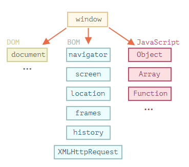
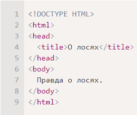
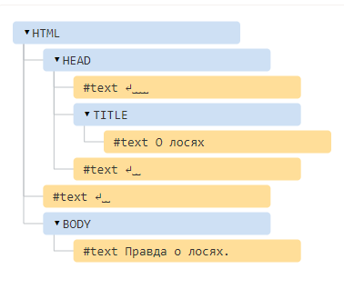
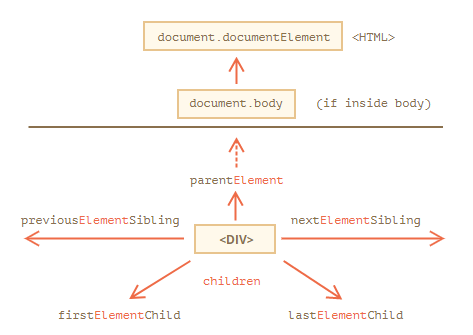
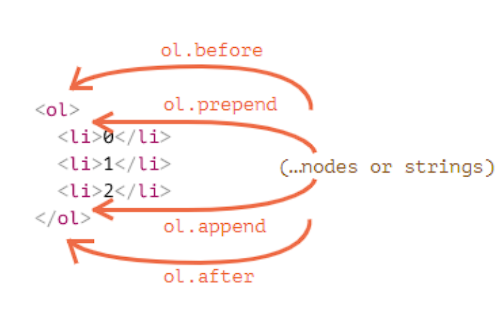
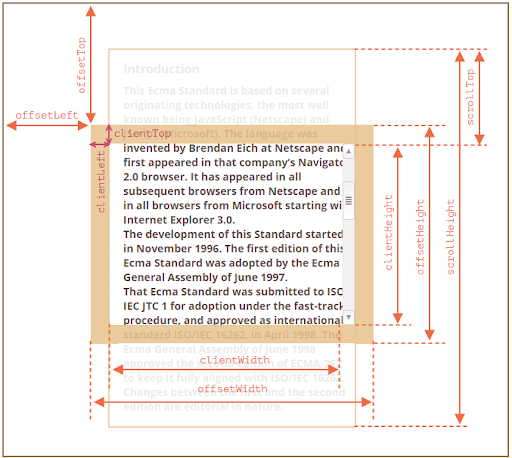
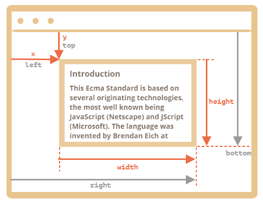
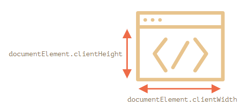

# Document Object Model and Window
Объектная модель документа (DOM) - это программный итерфейс, созданный для документов HTML и XML. Она представляет собой сущность, которая позволяет программам и скриптам динамически обновлять структуру, содержание и стиль документа. С помощью DOM мы можем легко получить доступ и манипулировать тегами, идентификаторами, классами, атрибутами и т. д.

Работа со страницой не является частью JS. Это возможность дается браузером путем предоставления API, которое можно использовать в коде JS. Каждый подключенный скрипт к странице имеет глобальный объект `window`, в котором и содержаться все свойства страницы и методы работы с ней.

> Помимо DOM, существует BOM (Browser Object Model) и [CSSOM](https://developer.mozilla.org/ru/docs/Web/API/CSS_Object_Model) (CSS Object Model)



`Window` как раз предоставляет глобальные объекты js.
Когда мы используем глобальный объект или функцию, это значит что они находятся в глобальном объекте `window`
```js
Object === window.Object // true
Array === window.Array // true

const newObj = new window.Object() // new Object()
```
Соответственно, когда мы создаем глобальную функцию или переменную без ключевых слов `let`, `const`, `var` (в не строгом режиме) они создаются как часть объекта `window`
```js
function helloWorld() {
    console.log('Hello world!');
}

helloWorld() // 'Hello world!'
window.helloWorld() // 'Hello world!'

console.log(helloWorld === window.helloWorld) // true

newVar = {a: 123};

console.log(newVar) // { a: 123 }
console.log(window.newVar) // { a: 123 }
console.log(newVar === window.newVar) // true
```
> Другими словами, ключевыми словами при создании переменных мы указываем их область видимости.

## Объектное представление страницы в виде дерева
Так как JS "это сплошной объект", то для удобства работы с элементами страницы они скомпанованы в удобном формате "узлов".

Каждый узел (node) дерева - это объект:
- Корневой узел - document
- Узлы, представленные тегами - элементы
- Текст внутри элементов - текстовые узлы
- Комментарии

И другие.

 

## BOM
BOM представляет из себя набор разнообразных API (Application Programming Interface) для отправки запросов, геолокации, управления историей браузера и т. д.
Например:
- `navigator` - объект с методами и свойствами приложения, запустившего скрипт.
- `location` - объект с информацией о текущем местоположении документа.
- `XMLHttpRequest` - создание и отправка HTTP запросов

## Навигация по DOM
- `document` - корневой узел
- `document.documentElement` - `<HTML>`
- `document.body` - `<BODY>`
- `parentElement` - родительский элемент (или `parentNode` - родительский узел)
- `nextElementSibling/previousElementSibling` - соседние элементы (`nextSibling/ previousSibling` - соседние узлы)
- `firstElementChild/lastElementChild/children` - дочерние элементы (`firstChild/lastChild/childNodes` - дочерние узлы)



### Поиск по дереву элементов
Для поиска по дереву элементов обычно используются три метода:
1. `document.getElementById` - возавращает первый найденный элемент по id.
2. `element.querySelector` - возвращает первый найденный элемент по css селектору.
3. `element.querySelectorAll` - возвращает все найденные элементы по css селектору.

Кроме того, существуют устаревшие методы:
- `document.getElementsByName`
- `element.getElementsByTagName`
- `element.getElementsByClassName`

#### `document.getElementById`
Находит элемент в DOM по атрибуту id.

Принимает один аргумент:
- `id` - атрибут id элемента

Возвращает `null`, если такого элемента не существует в DOM.

```html
<div id="greeting">Hello!</div>

<script>
    const elem1 = document.getElementById('greeting');

    console.log(elem1) // <div id="greeting">Hello!</div>

    const elem2 = document.getElementById('nothing');

    console.log(elem2) // null
</script>
```

#### `document.querySelector`
Находит первый элемент в DOM по CSS-селектору.

Принимает один аргумент:
- `cssSelector` - селектор для поиска элемента

Возвращает `null`, если такого элемента не существует в DOM.
```html
<div id="greeting" class="message">
    <span>Hello!</span>
</div>

<script>
    const elem1 = document.querySelector('#greeting');

    console.log(elem1) // <div id="greeting" class="message">...</div>

    const elem2 = document.querySelector('.message');

    console.log(elem2) // <div id="greeting" class="message">...</div>

    const elem3 = document.querySelector('.message span');

    console.log(elem3) // <span>Hello!</span>
</script>
```

#### `document.querySelectorAll`
Находит все присутствующие в DOM элементы по CSS-селектору.

Принимает один аргумент:
- `cssSelector` - селектор для поиска элементов

Возвращает коллекцию элементов (псевдо-массив). Если элементов не найдено - пустую коллекцию.

```html
<div class="message">Hello!</div>
<div class="message">Welcome!</div>
<div class="message">Buy!</div>

<script>
    const elems = document.querySelectorAll('.message');

    console.log(elems) // NodeList(3)
    console.log(Array.isArray(elems)) // false
    console.log(elems.forEach) // undefined

    for (let elem of elems) {
        console.log(elem) // <div class="message">...</div> x 3
    }
</script>
```
### Отличие от `getElementsBy*` и `querySelector*`
Хоть суть этих методов одна, они работают по-разному.

Особенность методов `getElementsBy*` в том, что они возвращают **живую** коллекцию.
Живая коллекция автоматически теряет элементы, если они были удалены из DOM.
```html
<div class="message">Hello!</div>
<div class="message">Welcome!</div>
<div class="message">Buy!</div>

<script>
    const elems = document.getElementsByClassName('message');

    console.log(elems.length) // 3

    elem[0].remove();
    
    console.log(elems.length) // 2
</script>
```

### `closest, matches, contains`
- `closest(cssSelector)` - возвращает первый родительский элемент (или сам элемент), удовлетворяющий селектору или `null`
- `matches(cssSelector)` - возвращает `true`, если элемент удовлетворяет селектору или `false`, если нет.
- `contains(elem)` - возвращает `true`, если элемент содержит в себе переданный в виде аргумента второй элемент. `false` - если нет.
```html
<div class="wrapper">
    <ul class="message-list">
        <li class="item">
            <div class="message">Hello!</div>
        </li>
        <li class="item">
            <div class="message">Welcome!</div>
        </li>
        <li class="item">
            <div class="message">Buy!</div>
        </li>
    </ul>
</div>

<script>
    const list = document.querySelector('.message-list');

    const firstli = document.querySelector('.item');
    const firstMsg = document.querySelector('.message');

    console.log(firstli.matches('.item')); // true
    console.log(firstli.matches('.wrapper')); // false

    console.log(firstLi.closest('.item')); // <li class="item">...</li>
    console.log(firstli.closest('.wrapper')); // <div class="wrapper">...</div>
    console.log(firstli.closest('.message')); // null

    console.log(firstli.contains(firstMsg)); // true
    console.log(firstli.contains(list)); // false
</script>
```

### `innerHTML`
`innerHTML` - свойство элемента, в котором хранится HTML-содержимое элемента.

- Его можно как читать, так и переприсваивать.
- Работает также и с тегами
- Скрипты, добавленные через `innerHTML`, не выполняются!
```html
<div class="greeting">
    <span class="message">Hello!</span>
</div>

<script>
    const greeting = document.querySelector('.greeting');
    const message = document.querySelector('.message');

    console.log(greeting.innerHTML) // '\n <span class="message">Hello!</span> \n'
    console.log(message.innerHTML) // Hello!

    message.innerHTML = 'Hi!';
    console.log(message.innerHTML) // Hi!

    greeting.innerHtml = '<p>Greeting</p>';
    console.log(greeting.innerHTML) // '<p>Greeting</p>'

    greeting.innerHTML = `
        <script>
            alert(1);
        </script>
    `; // тег со скриптом добавится но alert не выполнится

</script>
```

### `textContent`
Похож на `innerHTML`, однако содержит только текстовые данные. Все теги игнорируются, но отступы и переносы остаются.

Доступен для чтения и записи таким же образом.

```js
const greeting = document.querySelector('.greeting');
const message = document.querySelector('.message');

console.log(greeting.textContent) // Hello!
console.log(message.textContent) // Hello!

message.textContent = 'Hi!';
console.log(message.textContent) // Hi!
```

### `innerText`
Похож на `textContent`, только отбрасывает ненужные переносы. Другими словами - возвращает текст, который пользователь получит, если он выделит содержимое элемента курсором, затем копирует его в буфер обмена.

**Отличия от `textContent`**
- `textContent` получает содержимое всех элементов, включая `<script>` и `<style>`, тогда как `innerText` этого не делает.
- `innerText` умеет считывать стили и не возвращает содержимое скрытых элементов, тогда как `textContent` этого не делает.
- Метод `innerText` позволяет получить CSS, а `textContent` — нет.


### Существуют еще методы `outerHtml` и `outerText`.
При чтении значения они не отличаются от аналогичных `inner` методов. При записи значения отличаются тем, что заменяют текст **включая** текущий элемент.

## Свойства vs Атрибуты
Элементы - тоже объекты. Им тоже можно присваивать свойства, если это необходимо.

Стандартные атрибуты становятся свойствами элемента.

Нестандартные - нет.
```html 
<body id="body" lalala="blah!"></body>
<script>
    const { body } = document;

    body.currentuser = {
        name: 'Vasya'
    }

    console.log(body.currentUser) // { name: 'Vasya' }
    console.log(body.id) // body
    console.log(body.lalala) // undefined
</script>
```

Для работы непосредственно с атрибутами используются следующие методы:
- `hasAttribute(attrName)` - проверяет наличие атрибута
- `getAttribute(attrName)` - получает значение атрибута
- `setAttrubute(attrName, value)` - устанавливает значение атрибута
- `removeAttribute(attrName)` - удаляет атрибут
```js
const { body } = document;

console.log(body.hasAttribute('id')); // true
console.log(body.getAttribute('id')); // body

console.log(body.getAttribute('lalala')); // 'blah!'
console.log(body.setAttribute('lalala', 'hello'));
console.log(body.getAttribute('lalala')); // 'hello'

console.log(body.removeAttribute('lalala'));
console.log(body.getAttribute('lalala')); // null
```

## Манипуляции с DOM-элементами
Быстрее всего создать или удалить элемент присваивая его родителю html текст через `innerHTML`. Но  иногда требуется более гибкая возможность делать определенные опреации с элементами.

Для люой манипуляции есть свои методы елементов.
- `document.createElement(tagName)` - принимает имя тега в виде аргумента и возвращает элемент.
- `elem.append/prepend(...elems)` - вставка элемента(ов) в начале/конце элемента `elem`.
- `elem.before/after(...elems)` - вставка элемента(ов) до/после элемента `elem`.
- `elem.replaceWith(...elems)` - замена элемента `elem` элементом(ами).
- `elem.remove()` - удаление элемента `elem` из DOM
- `elem.cloneNode(isDeep = false)` - клонирование элемента `elem`.



## Стили и классы
В JavaScript существует два основных способа манипуляции стилями:
- `classList` - свойство элемента, которое позволяет манипулировать CSS-классами элемента
- `style` - свойство элемента для манипуляции отдельными CSS-свойствами

#### `classList`

`classList` предоставляет несколько полезных методов для управления классами:
- `classList.add/remove(className)` - удаляет класс
- `classList.toggle(className)` - добавляет класс, если нет. Удаляет, если есть.
- `classList.contains(className)` - возвращает `true`, если класс присутствует в списке элементов и `false`, если нет.

```html
<div class="container"></div>
<script>
    const elem = document.querySelector('.container');

    elem.classList.add('active'); // <div class="container active"></div>
    elem.classList.remove('active'); // <div class="container"></div>

    elem.classList.toggle('open'); // <div class="container open"></div>
    elem.classList.toggle('open'); // <div class="container"></div>

    elem.classList.contains('open'); // false
    elem.classList.contains('container'); // true
</script>
```

#### `style`
Данное свойство соответствует атрибуту `style` в HTML разметке.

- доступ к свойствами осуществляется через точку.
- свойства, содержащие дефис переводятся в camelCase
- присвоение пустой строки удаляет свойство

```html
<div class="container" style="border: 1px solid black">
<script>
    const elem = document.querySelector('.container');

    elem.style.width = '100px';
    elem.style.zIndex = '5';
    elem.style.backgroundColor = '#ccc';

    elem.style.border = '';

</script>
<!-- После выполнения кода -->
<div class="container" style="width: 100px; z-index: 5; background-color: rgb(204, 204, 204);">
```

`classList` является более предпочтительным способом управления стилями, так как оно позволяет разделять стили элемента и логику скрипта.

Однако, в ряде ситуаций `classList` не даёт нам необходимой гибкости.

Когда нам необходимо выполнить сложную анимацию, изменять стили постепенно или точно спозиционировать элемент в окне, мы можем использовать свойство `style`.

## Размеры элемента
- `offsetParent` – ближайший CSS-позиционированный родитель 
(ближайший родитель с установленным css-свойством `position`, или body).
- `offsetLeft/offsetTop` – позиция относительно `offsetParent`.
- `offsetWidth/offsetHeight` – «внешняя» ширина/высота элемента
- `clientLeft/clientTop` – расстояние от верхнего левого внешнего угла до внутреннего.
- `clientWidth/clientHeight` – ширина/высота содержимого вместе с `padding`.
- `scrollWidth/scrollHeight` – ширины/высота содержимого с прокрученной областью.
- `scrollLeft/scrollTop` – ширина/высота прокрученной сверху части элемента



#### `elem.getBoundingClientRect`
Данный метод возвращает объект со следующими свойствами:
- `x/y` – X/Y-координаты начала прямоугольника относительно окна
- `width/height` – ширина/высота прямоугольника (могут быть отрицательными).
- `top/bottom` – Y-координата верхней/нижней границы прямоугольника,
- `left/right` – X-координата левой/правой границы прямоугольника.




## Размеры окна
- `window.innerHeight/innerWidth` - высота/ширина окна
- `document.documentElement.clientHeight/clientWidth` -  высота/ширина окна без ширины скролла.



## Прокрутка окна
- `window.pageXOffset/pageYOffset` - текущая прокрутка окна
- `window.scrollTo(pageX, pageY)` - прокрутка к определённому месту страницы
- `window.scrollBy(x, y)` - прокрутка на определённое количество пикселей.
- `elem.scrollIntoView(isTop = true)` - прокручивает окно к элементу elem.
    - `isTop`:
        - `true` - верхняя часть элемента будет выровнена по верхней части видимой области `offsetParent`.
        - `false` - нижняя часть элемента будет выровнена по нижней части видимой области `offsetParent`.
