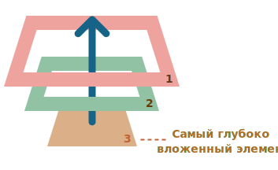

# DOM Event phases
События в DOM-дереве происходят в две фазы - погружение и всплытие.

**Пример:**
Этот обработчик для `<div>` сработает, если вы кликните по любому из вложенных тегов, будь то `<em>` или `<code>`:
```html
<div onclick="alert('Обработчик!')">
  <em>Если вы кликните на <code>EM</code>, сработает обработчик на <code>DIV</code></em>
</div>
```
> Почему же сработал обработчик на `<div>`, если клик произошёл на `<em>`?

## Всплытие
Принцип всплытия очень простой.

Когда на элементе происходит событие, обработчики сначала срабатывают на нём, потом на его родителе, затем выше и так далее, вверх по цепочке предков.

Например, есть 3 вложенных элемента `FORM > DIV > P` с обработчиком на каждом.

> Пример `./DOM_Event_phases_examples/bubbling.html`

Клик по самому вложенному элементу вызовет это событие вверх по цепочке родителей.



Поэтому если кликнуть на `<p>`, то мы увидим три оповещения: `p` → `div` → `form`.

Этот процесс называется «всплытием», потому что события «всплывают» от внутреннего элемента вверх через родителей подобно тому, как всплывает пузырёк воздуха в воде.

### `event.target` и `event.currentTarget`
Всегда можно узнать, на каком конкретно элементе произошло событие.

Самый глубокий элемент, который вызывает событие, называется целевым элементом, и он доступен через `event.target`.

«Текущий» элемент, до которого дошло всплытие и на котором сейчас выполняется обработчик доступен через `event.currentTarget`.
> На этот-же элемент ссылается переменная `this` внутри обработчика.

Например, если стоит только один обработчик `form.onclick`, то он «поймает» все клики внутри формы. Где бы ни был клик внутри – он всплывёт до элемента `<form>`, на котором сработает обработчик.

При этом внутри обработчика `form.onclick`:

- `this` (=`event.currentTarget`) всегда будет элемент `<form>`, так как обработчик сработал на ней.
- `event.target` будет содержать ссылку на конкретный элемент внутри формы, на котором произошёл клик.

**Почти все события всплывают.**

Ключевое слово в этой фразе – «почти».

Например, событие `focus` не всплывает. Однако, стоит понимать, что это скорее исключение, чем правило, всё-таки большинство событий всплывают.

## Погружение
Существует ещё одна фаза из жизненного цикла события – «погружение» (иногда её называют «перехват»). Она очень редко используется в реальном коде, однако тоже может быть полезной.

Стандарт [DOM Events](https://www.w3.org/TR/uievents/) описывает 3 фазы прохода события:

1. Фаза погружения (capturing phase) – событие сначала идёт сверху вниз.
2. Фаза цели (target phase) – событие достигло целевого(исходного) элемента.
3. Фаза всплытия (bubbling stage) – событие начинает всплывать.

Картинка из спецификации демонстрирует, как это работает при клике по ячейке `<td>`, расположенной внутри таблицы:


> То есть при клике на `<td>` событие путешествует по цепочке родителей сначала вниз к элементу (погружается), затем оно достигает целевой элемент (фаза цели), а потом идёт наверх (всплытие), вызывая по пути обработчики.

Обработчики, добавленные через `on<event>`-свойство или через HTML-атрибуты, или через `addEventListener(event, handler)` с двумя аргументами, ничего не знают о фазе погружения, а работают только на 2-ой и 3-ей фазах.

Чтобы поймать событие на стадии погружения, нужно использовать третий аргумент capture вот так:
```js
elem.addEventListener(..., {capture: true})
// или просто "true", как сокращение для {capture: true}
elem.addEventListener(..., true)
```

Существуют два варианта значений опции `capture`:

Если аргумент `false` (по умолчанию), то событие будет поймано при всплытии.
Если аргумент `true`, то событие будет перехвачено при погружении.

Вторую фазу (target phase) нельзя обработать отдельно, при её достижении вызываются все обработчики: и на всплытие, и на погружение.


> Пример `./DOM_Event_phases_examples/capturing_and_bubbling.html`

Если кликнуть по `<p>`, то последовательность следующая:

1. `HTML` → `BODY` → `SECTION` → `FORM` → `DIV` (фаза погружения, первый обработчик)
2. `P` (фаза цели, срабатывают обработчики, установленные и на погружение и на всплытие, так что выведется два раза)
3. `DIV` → `FORM` → `SECTION` → `BODY` → `HTML` (фаза всплытия, второй обработчик)

**Чтобы убрать обработчик `removeEventListener`, нужна та же фаза**

Если мы добавили обработчик вот так `addEventListener(..., true)`, то мы должны передать то же значение аргумента `capture` в `removeEventListener(..., true)`, когда снимаем обработчик.

**На каждой фазе разные обработчики на одном элементе срабатывают в порядке назначения**

Если у нас несколько обработчиков одного события, назначенных `addEventListener` на один элемент, в рамках одной фазы, то их порядок срабатывания – тот же, в котором они установлены:
```js
elem.addEventListener("click", e => alert(1)); // всегда сработает перед следующим
elem.addEventListener("click", e => alert(2));
```

## Прекращение распространения всплытия/погружения
Всплытие идёт с «целевого» элемента прямо наверх. По умолчанию событие будет всплывать до элемента `<html>`, а затем до объекта `document`, а иногда даже до `window`, вызывая все обработчики на своём пути. Тоже самое и с погружением только в обратном порядке.

Но любой промежуточный обработчик может решить, что событие полностью обработано, и остановить всплытие.

Для этого нужно вызвать метод `event.stopPropagation()`.
> Пример `./DOM_Event_phases_examples/stop_propagation.html`

В примере при клике на кнопку `<button>` обработчик клика на `body` не сработает на фазе **всплытия**. Так же обработчик на `span` не сработает на фазе **погружения**.

#### `event.stopImmediatePropagation()`
Если у элемента есть несколько обработчиков на одно событие, то даже при прекращении всплытия все они будут выполнены.

То есть, `event.stopPropagation()` препятствует продвижению события дальше, но на текущем элементе все обработчики будут вызваны.

Для того, чтобы полностью остановить обработку, существует метод `event.stopImmediatePropagation()`. Он не только предотвращает всплытие, но и останавливает обработку событий на текущем элементе.

# Итого
При наступлении события – самый глубоко вложенный элемент, на котором оно произошло, помечается как «целевой» (`event.target`).
- Затем событие сначала двигается вниз от корня документа к `event.target`, по пути вызывая обработчики, поставленные через `addEventListener(...., true)`, где `true` – это сокращение для `{capture: true}`.
- Далее обработчики вызываются на целевом элементе.
- Далее событие двигается от `event.target` вверх к корню документа, по пути вызывая обработчики, поставленные через `on<event>` и `addEventListener` без третьего аргумента или с третьим аргументом равным `false`.

Каждый обработчик имеет доступ к свойствам события `event`:

- `event.target` – самый глубокий элемент, на котором произошло событие.
- `event.currentTarget`(=`this`) – элемент, на котором в данный момент сработал обработчик (тот, на котором «висит» конкретный обработчик)
- `event.eventPhase` – на какой фазе он сработал (погружение=1, фаза цели=2, всплытие=3).

Любой обработчик может остановить событие вызовом `event.stopPropagation()`, но делать это не рекомендуется, так как в дальнейшем это событие может понадобиться, иногда для самых неожиданных вещей.