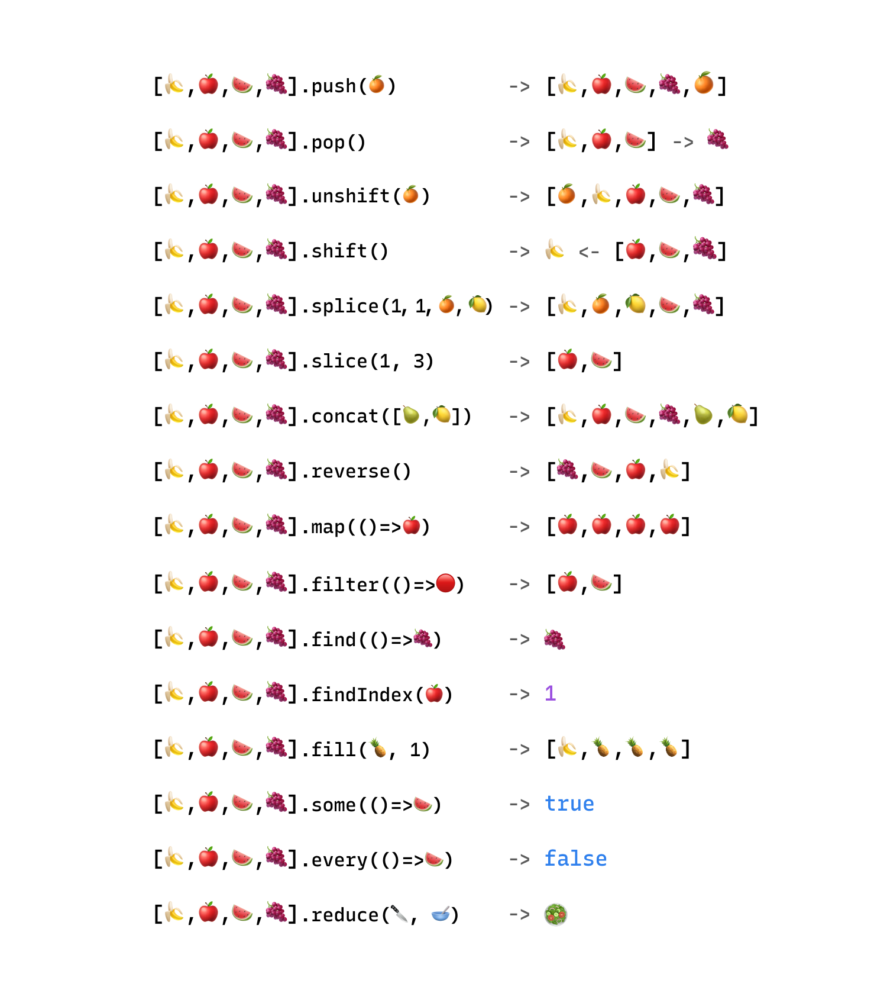

# Arrays

Массивы - это объекты, которые хранят коллекцию элементов и могут быть присвоены переменной. У них есть свои методы, которые могут выполнять операции над этими элементами.

В отличии от обычных объектов они хранят данные по индексу, так они понимают в каком порядке хранятся в них данные.

По аналогии с объектами `Object` есть два варианта создания массива:

```js
let arr = new Array(); // через конструктор
let arr = []; // через литерал
```

Создавая новый массив в него сразу можно поместить данные. От порядка будет зависеть какой индекс присвоится какому значению.

> Элементы массива нумеруются, начиная с нуля.

> Длинна массива ВСЕГДА на 1 больше чем последний индекс

Получить значение, находящееся под определенным индексом можно с помощью `[index]` или метода `.at(index)`

```js
let fruits = ['Яблоко', 'Апельсин', 'Слива'];

fruits[0] // Яблоко
fruits[1] // Апельсин
fruits[2] // Слива
fruits.at(2) // Слива
fruits.at(-1) // Слива
fruits.length // 3
```

> Метод `.at` позволяет получать элемент с конца массива указав отрицательный индекс. Синтаксис через `[]` не позволяет такого делать.

По аналогии с получением элемента по индексу `fruits[0]` можно переписать значение под этим индексом с помощью оператора присваивания `=`

```js
fruits[2] = 'Груша'; // теперь ["Яблоко", "Апельсин", "Груша"]
```

Указав следующий индекс можно добавить новый элемент в массив

```js
fruits[3] = 'Лимон'; // теперь ["Яблоко", "Апельсин", "Груша", "Лимон"]
```

Метод `at` не позволяет записать значение, так как он не хранит ссылки на индекс, он просто возвращает значение.

```js
fruits.at(0) = 'Арбуз' // Uncaught ReferenceError: Invalid left-hand side in assignment
```
Но, есть метод, который позволяет записывать значения `.with(index, value)`. Новый метод, добавлен в последних версиях ES.
Изменяет значение заданного индекса в массиве, возвращая новый массив, в котором элемент с заданным индексом заменен на заданное значение. Исходный массив не изменяется.
```js
const newFruits = fruits.with(0, 'Арбуз')

newFruits // ["Арбуз", "Апельсин", "Груша", "Лимон"]
fruits // ["Яблоко", "Апельсин", "Груша", "Лимон"]
newFruits === fruits // false
```

В массиве могут храниться элементы любого типа

```js
// разные типы значений
let arr = [
    'Яблоко',
    { name: 'Джон' },
    true,
    function () {
        alert('привет');
    },
];

// получить элемент с индексом 1 (объект) и затем показать его свойство
alert(arr[1].name); // Джон

// получить элемент с индексом 3 (функция) и выполнить её
arr[3](); // привет
```
## Деструктуризация массива
```js
let arr = ["Ilya", "Kantor"];

// деструктурирующее присваивание
let [firstName, surname] = arr;

firstName // 'Ilya'
surname // 'Kantor'
```
Теперь, если бы у нас было значение, которое содержит Имя и Фамилию в строке, мы смогли бы одной записью разделить её на две переменные
```js
const [firstName, surname] = 'Ilya Kantor'.split(' '); // split - разделяет строку на массив по разделителю

firstName // 'Ilya'
surname // 'Kantor'
```
«Деструктурирующее присваивание» не уничтожает массив. Оно вообще ничего не делает с правой частью присваивания, его задача – только скопировать нужные значения в переменные.

Это просто короткий вариант записи:
```js
// let [firstName, surname] = arr;
let firstName = arr[0];
let surname = arr[1];
```
Нежелательные элементы массива также могут быть отброшены с помощью дополнительной запятой:
```js
// второй элемент не нужен
let [firstName, , title] = ["Julius", "Caesar", "Consul", "of the Roman Republic"];

title // Consul - 3-й элемент
```
Мы можем использовать что угодно «присваивающее» с левой стороны.

Например, можно присвоить свойству объекта:
```js
let user = {};
[user.name, user.surname] = "Ilya Kantor".split(' ');

user // { name: 'Ilya', surname: 'Kantor' }
```

Цикл с `.entries()`
```js
let user = {
  name: "John",
  age: 30
};

// цикл по ключам и значениям
for (let [key, value] of Object.entries(user)) {
    console.log(`${key}:${value}`); // name:John, затем age:30
}
```
Обмен переменными
```js
let guest = "Jane";
let admin = "Pete";

// Cоздаём временный массив из двух переменных и немедленно деструктурируем его в порядке замены
[guest, admin] = [admin, guest];

guest // Pete
admin // jane
```
Если мы хотим не просто получить первые значения, но и собрать все остальные, то мы можем добавить ещё один параметр, который получает остальные значения, используя `rest` оператор – троеточие `...`:
```js
let [name1, name2, ...rest] = ["Julius", "Caesar", "Consul", "of the Roman Republic"];

name1 // Julius
name2 // Caesar
// rest это массив элементов, начиная с 3-го
rest[0]; // Consul
rest[1]; // of the Roman Republic
rest.length; // 2
```
Значения по умолчанию:

Если мы хотим, чтобы значение «по умолчанию» заменило отсутствующее, мы можем указать его с помощью `=`:
```js
// значения по умолчанию
let [name = "Guest", surname = "Anonymous"] = ["Julius"];

name    // Julius (из массива)
surname // Anonymous (значение по умолчанию)
```
Так как массивы по себе - объекты, "под капотом" они выглядят так:
```js
[1, 2] - > {
    0: 1,
    1: 2,
    length: 2
    [[Prototype]]: Array()
}
```
Это значит их можно деструктурировать с помощью `{...}` как обьекты:
```js
const { 0: first, 1: second, length } = [1, 2];

first // 1
second // 2
length // 2
```
> Так как переменные, которые начинаются с чисел не валидны в JS, то эти индексы нужно переименовать в валидные переменные
## Spread `...`
Как и в случае с объектами, создать поверхносную копию массива можно с помощью оператора `...spread`:
```js
const arr = [1, 2, 3, {}];

const arr2 = [...arr];

arr2 // [1, 2, 3, {}]
arr // [1, 2, 3, {}]

arr === arr2 // false
arr[3] === arr2[3] // true
```
Основная задача такого синтаксиса - это более лаконичное создание новых массивов из существующих.
Это альтернатива (синтаксический сахар) для большинства методов массива.

Им можно полностью или частично заменить методы: `.push()`, `.shift()`, `.unshift()` `.splice()`, `.concat()`, `.slice()`.
```js
const arr = [1, 2, 3, {}];
const arr2 = arr.concat(); // arr2 = [...arr];
const arr3 = arr.concat([4, 5], 6) // arr3 = [...arr, ...[4, 5], 6]

const arr4 = arr.concat();
arr4.unshift(0);
arr4.push(4);
// OR
arr4.splice(0, 0, 0) // добавит 0 в начало массива
arr4.splice(100, 0, 4) // добавит 4 в конец массива
// arr4 = [0, ...arr, 4]

arr4 // [0, 1, 2, 3, {}, 4]

const arr5 = arr.slice(); // делает тоже-самое что и .concat()
const firstItem = arr5.shift()

const [firstItem, ...arr5] = arr // - технически, тут используется rest оператор а не spread
```
С помощью этого оператора можно "распределить" элементы массива там, где бы мы их писали через `,`
```js
const nums = [1, 2, 3];

// Функция sum(...numers) принимает неограниченное колличество аргументов и суммирует их

sum(1, 2) // 3
sum(...nums) // 6
sum(3, 2, 1, ...nums) // 12
```
## Сравнение массивов

Массив - это разновидность объекта (ссылочный тип данных). Таким образом, многие его свойства аналогичны обыкновенному объекту.

-   При сравнении в другими объектами массив равен только самому себе.
-   При **нестрогом** сравнении с примитивами приводится к строке.

```js
typeof [] // 'object'

const array = [];
array === [] // false
array == [] // false
array === array // true

[].toString() // ''
[1].toString() // '1'
[1,2,3].toString() // '1,2,3'

[] == '' // true
[] == true // false
[] == false // true
[1] == [1] // false
[1] == 1 // true
[1,2] == '1,2' // true

```
Вопрос: Что выведет консоль

```js
console.log([] ? true : false);
```

## Разреженные массивы

Массивы очень хорошо оптимизированы для работы с упорядоченными данными.
Однако, вы можете присвоить массиву значение на совершенно любую позицию.

В итоге мы получим массив с пустыми значениями. Это отключит встроенные оптимизации массива. То же касается и присвоения строковых свойств массиву.

Используйте массив только для работы с упорядоченными значениями.

```js
const array1 = [1];

array[9] = 10;

array.length; // [1, empty x 8, 10]
array.length; // 10

const array2 = [1];

array2['abc'] = 10;

array2; // [1, abc: 10]
array2.length; // 1

array2[-1] = 1;

array2; // [1, abc: 10, -1: 1]
array2.length; // 1
```

Можем сделать небольшой бенчмарк, чтобы увидеть разницу
```js
// Создаем новый массив с миллионом нулей
let arr = Array.from({ length: 1_000_000 }, () => 0)

console.time('map arr') // начинаем замер обычного массива
let newArr = [];
for (let i = 0; i < arr.length; i++) {
    newArr.push(arr[i] + i); // складываем каждый 0 с индексом и кладем в newArr
}
console.timeEnd('map arr') // заканчиваем замер

// удаляем элементы
delete arr[10]
delete arr[50]
delete arr[100]
delete arr[500]
delete arr[1000]
delete arr[5000]
delete arr[10_000]

// добавляем нечисловые индексы
arr['abc'] = 0;
arr[false] = 1;

console.time('map spare arr') // начинаем новый замер
let newArr2 = [];
for (let i = 0; i < arr.length; i++) {
    newArr2.push(arr[i] + i); // складываем каждый 0 с индексом и кладем в newArr2
}
console.timeEnd('map spare arr') // заканчиваем замер
```
Результат:
```js
// Запуск номер 1
// map arr: 8.549072265625 ms
// map spare arr: 19.704833984375 ms


// Запуск номер 2
// map arr: 15.14501953125 ms
// map spare arr: 22.755126953125 ms


// Запуск номер 3
// map arr: 10.747802734375 ms
// map spare arr: 17.89208984375 ms

// Среднее
// map arr: 11.4 ms
// map spare arr: 20.1 ms
```

## Методы массивов

0. `Array.isArray` (статический метод): надежная проверка значения на пренадлежность к массивам
    ```js
    const array = [1, 2, 3];
    Array.isArray(array); // true
    Array.isArray({ 0: 1, 1: 2, 2: 3 }); // false
    ```
1. `pop`: удаляет последний элемент массива и возвращает его

    ```js
    const value = array.pop();

    value; // 3
    array; // [1, 2]
    ```

2. `push`: добавляет новый элемент в конец массива. Можно добавлять несколькоо элементов за раз.

    ```js
    array.push(3);
    array; // [1,2,3]

    array.push(4, 5);
    array; // [1,2,3,4,5]
    ```

3. `shift`: удаляет первый элемент массива и возвращает его (сдвигает элементы в массиве)

    ```js
    const value = array.shift();

    value; // 1
    array; // [2,3,4,5]
    ```

4. `unshift`: добавляет элементы в начало массива (сдвигает элементы). Можно добавлять несколько штук за раз.

    ```js
    array.unshift(1);
    array; // [1,2,3,4,5]

    array.unshift(-1, 0);
    array; // [-1, 0, 1, 2, 3, 4, 5]
    ```
5. `splice`: удаляет или добавляет элементы внутри массива, не создавая пустот. Мутирует основной массив и возвращает новый массив удаленных элементов.

    `splice(startIndex, deleteCount, ...elementsToAdd)`:
    - `startIndex` - индекс элемента, с которого начинается операция. Отрицательный индекс начинает отсчёт с конца. Значение, которое больше максимального индекса добавит элементы в конец.
    - `deleteCount` - количество элементов для удаления. Если не указан - до конца массива.
    - `elementsToAdd` - элементы, которые будут вставлены вместо удалённых.

    ```js
    const value = array.splice(0, 3); // удаляет первые три элемента

    value // [-1, 0, 1]
    array // [2, 3, 4, 5]

    const value2 = array.splice(-2, 2, '4', '5', '6', '7', '8') // удаляет последние два элемента и добавляет новые

    value2 // [4, 5]
    array // [2, 3, '4', '5', '6', '7', '8']

    const value3 = array.splice(0, 0, ...value); // только добавляет новые элементы в начало массива

    value3 // []
    array // [-1, 0, 1, 2, 3, '4', '5', '6', '7', '8']

    const value4 = array.splice(5); // удаляет все елементы с 5-го индекса и до конца

    value4 // ['4', '5', '6', '7', '8']
    array // [-1, 0, 1, 2, 3]
    ```
6. `slice`: возвращает новый массив со скопированным фрагментом исходного массива.

    `slice(startIndex, endIndex)`:
    - `startIndex` - индекс элемента, с которого нужно начать копирование **(включая)**
    - `endIndex` - индекс элемента, на котором нужно закончить копирование **(исключая)**
    - Разрешены также отрицательные индексы для отсчёта с конца.

    ```js
    const value1 = array.slice(1, 4); // копирует елементы с 1-го индекса по 4-й (елементы со 2-го по 5-й)

    value1 // [0, 1, 2]
    array // [-1, 0, 1, 2, 3] - исходный массив не меняется, он в безопасности

    const value2 = array.slice(1, -1) // копирует элементы с 1-го индекса до 3-го (елементы со 2-го по пред-последний)
    value2 // [0, 1, 2]

    const value3 = array.slice(-2) // копирует последние два элемента
    value3 // [2, 3]

    const value4 = array.slice() // копирует массив полностью
    value4 // [-1, 0, 1, 2, 3]
    ```
7. `concat`: соединяет все полученные массивы (или отдельные элементы) и исходный в один новый массив
    ```js
    const array2 = array.concat([4, 5]);
    array2 // [-1, 0, 1, 2, 3, 4, 5]
    array //  [-1, 0, 1, 2, 3] - исходный массив не меняется

    const array3 = array.concat([4, 5], [6, 7], 8, 9, 0);
    array3 // [-1, 0, 1, 2, 3, 4, 5, 6, 7, 8, 9, 0]
    ```
8. Методы поиска по массиву:

    1. `indexOf`: принимает элемент массива и возвращает его индекс в массиве, либо -1, если элемент не найден.
    ```js
    array.indexOf(2) // 3
    array.indefOf(100) // -1

    array3.indexOf(0, 2) // 11 - начинает поиск с индекса 2
    ```
    2. `find` - принимает функцию с элементом. Возвращает первый элемент, для которого функция вернёт `true`. Если такого нет - возвращает `undefined`.
    ```js
    const elem1 = array.find((elem) => {
        return elem === 2;
    });

    elem1 // 3

    const elem2 = array.find((elem) => {
        return elem === 100;
    });

    elem2 // undefined
    ```
    3. `findIndex` - подобен find, но возвращает индекс элемента, а не сам элемент. Либо -1, если элемент не найден
    ```js
    const elem1 = array.findIndex((elem) => {
        return elem === 2
    });

    elem1 // 3

    const elem2 = array.findIndex((elem) => {
        return elem === '2'
    });

    elem2 // -1
    ```
9. Методы проверки массива:
    
    1. `includes`: принимает элемент в виде аргумента. Проверяет наличие этого элемента в массиве.
        ```js
        array.includes(0) // true
        array.includes(100) // false
        ```
    2. `every`: принимает функцию с элементом в виде аргумента. Возвращает `true`, если вызов функции на каждом элементе возвращает `true` (аналогично операции И `&&`).
        ```js
        array.every((elem) => typeof elem === 'number') // true
        array.every((elem) => elem - elem) // false - если первый вызов функции вернул false то дальше уже не проверяет
        ```
    3. `some` - принимает функцию с элементом в виде аргумента. Возвращает `true`, если вызов функции хотя бы на одном элементе возвращает `true` (аналогично операции ИЛИ `||`).
        ```js
        array.some(elem => elem === 1) // true
        array.some(elem => elem > 10) // false
        ```
10. `sort`: принимает функцию сравнивания. Производит сортировку массива **изменяя** исходный массив.

    **Без аргументов sort производит сортировку по строковым значениям элементов.**
    ```js
    const arr = [1, 12, 10, 9, 4, 3, 5, 2, 0];

    arr.sort();

    arr // [0, 1, 10, 12, 2, 3, 4, 5, 9] - приводит каждый элемент к строке, соответственно сравнивает посимвольно
    ```
    Принимает функцию с двумя параметрами. Если функция возвращает:
    - `-1` (меньше 0) - ставит первый элемент перед вторым (`a` станет первым)
    - `0` - не меняет порядок.
    -  `1` (больше 0) - ставит первый элемент после второго (`a` станет вторым)
    ```js
    arr.sort((a, b) => {
        if (a < b) {
            return -1;
        } else {
            return 1;
        }
    });

    arr // [0, 1, 2, 3, 4, 5, 9, 10, 12]
    ```
11. `reverse`: меняет порядок элементов на обратный изменяя исходный массив.
    ```js
    arr.reverse();

    arr // [12, 10, 9, 5, 4, 3, 2, 1, 0]
    ```
12. Преобразование массива в строку и наоборот:
    
    1. `split`: метод строки, разбивающий её на массив подстрок. Принимает разделитель в виде аргумента.
        ```js
        const str = 'Vasya-Vanya-Petya';
        const namesArr = str.split('-'); 

        namesArr // ['Vasya', 'Vanya', 'Petya']
        ```
    2. `join`: метод массива, соединяющий элементы массива в строку. Принимает разделитель в виде аргумента.
        ```js
        const namesStr = namesArr.join(':');
        namesStr // 'Vasya:Vanya:Petya'
        ```
11. `filter`: создает новый массив с отфильтрованными значениями исходного.

    Метод принимает функцию с элементом и добавляет проверяемый элемент в новый массив, если функция возвращает true
    ```js
    const array = [1, 2, 3, 4, 5, 6];

    const evens = array.filter(num => !(num % 2));

    evens // [2, 4, 6]
    array // [1, 2, 3, 4, 5, 6] - не изменился

    const people = [
        { name: 'Vasya', gender: 'male'},
        { name: 'Katya', gender: 'female'},
        { name: 'Vanya', gender: 'male'},
        { name: 'Anya', gender: 'female'},
    ];

    const boys = people.filter(
        (person) => person.gender === 'male'
    );
    const girls = people.filter(
        (person) => person.gender === 'female'
    );

    boys // [{ name: 'Vasya', gender: 'male'}, { name: 'Vanya', gender: 'male'}]
    girls // [{ name: 'Katya', gender: 'female'}, { name: 'Anya', gender: 'female'}]
    ```
12. Методы перебора массива:
    
    Перебор массива может производиться несколькими способами.
    - Циклы `while, for`
    - Цикл `for...of`

    Они отличаются методом их работы, то что делать с массивом уже определяется нами.

    Тоесть, сначала мы определяем цикл, условие по которому мы проходимся по массиву и в его теле описываем нужные операции для каждого элемента.

    Методы массива, в свою очередь, отличаются тем, что нужно сделать с массивом. Работая с ними мы просто опускаем определение и условие перебора сразу описывая то, что нужно делать с каждым элементом.
    1. `forEach`: принимает функцию и поочередно вызывает её с каждым элементом массива:
    
        `forEach((elem, index, sourceArray) => {})`
        - `elem`: элемент массива
        - `index`: индекс элемента
        - `sourceArray`: перебираемый массив

        ```js
        const array = [1, 2, 3, 4];

        array.forEach((elem, index, sourceArray) => {
            console.log(elem) // 1, 2, 3, 4
            console.log(index) // 0, 1, 2, 3
            console.log(sourceArray) // [1, 2, 3, 4]
        });

        // аналогичный перебор, если писать его через цикл for
        for (
            let index = 0, sourceArray = array, elem = array[index];
            index < array.length;
            elem = array[++index]
        ) {
            // или остальные переменные можно обьявить тут
            // let elem = array[index];
            // let sourceArray = array;

            console.log(elem) // 1, 2, 3, 4
            console.log(index) // 0, 1, 2, 3
            console.log(sourceArray) // [1, 2, 3, 4]
        }
        ```
    2. `map`: принимает функцию и создаёт новый массив из значений, которые вернула функция для каждого элемента.

        `map((elem, index, sourceArray) => {})`
        - `elem`: элемент массива
        - `index`: индекс элемента
        - `sourceArray`: перебираемый массив

        ```js
        const array = [1, 2, 3, 4];

        const doubled = array.map((elem) => elem * 2);

        doubled // [2, 4, 6, 8]
        array // [1, 2, 3, 4] - не изменился

        // аналогично, если писать это через цикл for-of
        const doubled = [];
        for (let elem of array) {
            doubled.push(elem * 2);
        }
        doubled // [2, 4, 6, 8]
        ```
    3. `reduce`/`reduceRight`: принимает функцию и начальное значение. Возвращает то, что мы захочем. На каждой итерации функция получает результат прошлого вызова и текущий елемент массива.

        `reduce((result, elem, index, sourceArray) => {}, initalValue)`
        - функция, выполняющаяся для каждого элемента:
            - `result`: результат прошлой итерации
            - `elem`: элемент массива
            - `index`: индекс массива
            - `sourceArray`: перебираемый массив
        - `initialValue` - начальное значение.

        ```js
        const array = [1, 2, 3, 4, 5];

        const sum = array.reduce((result, elem) => {
            return result + elem;
        }, 0);

        sum // 15
        ```
        Что произолшо на каждой итерации:

        1. `result` равен `initialValue` (то есть, 0). `elem` - первый элемент массива (то есть, 1). Первая итерация возвращает `0 + 1`.
        2. `result` равен результату предыдущей итерации - 1. `elem` - второй элемент массива. Возвращается `1 + 2`.
        3. `result` равен результату предыдущей итерации - 3. `elem` - третий элемент массива. Возвращается `3 + 3`.
        4. и т.д.
        
        После того, как все итерации прошли `reduce` возвращает результат полседней итерации в переменную `sum`

        `reduce` часто используется из-за его универсальности. С помощью него можно изменить, отфильтровать, отсортировать массив, преобразовать в другой тип и т.д.,
        
        Например можно сделать аналогичную операцию как `Object.fromEntries([['a', 1], ['b', 2]]) // { a: 1, b: 2 }`
        ```js
        const array = [['a', 1], ['b', 2]];

        const obj = array.reduce((acc, [key, value]) => {
            acc[key] = value;

            return acc;
        }, {});

        obj // { a: 1, b: 2 }
        ```

        **Важно!**
        Функция в reduce всегда должна возвращать значение! (в основном это первый параметр). Без этого, в следующую итерацию попадет `undefined`.

        `reduceRight` - делает тоже-самое, только начинает с конца массива.

Иллюстрация методов массивов:


        
### Мутирующие и не мутирующие методы

*Мутирующими* называются методы, которые изменяют изначальный массив. В некоторых подходах программирования мутации данных считаются **крайне вредным** явлением.

Поэтому, очень важно помнить, какие методы массива мутируют данные, а какие - нет

1. Мутирующие методы:
    ```js
    // удаление елементов
    .pop()
    .shift()

    // добавление елементов
    .push()
    .unshift()

    // замена елементов
    .splice()

    // сортировка
    .sort()

    // и реверс
    .reverse()
    ```
2. Не мутирующие методы:
    ```js
    // копирование массива
    .slice()

    // объединение массивов
    .concat()

    // фильтрация
    .filter()

    // изменение путем создания нового массива
    .map()

    // и редьюс
    .reduce()
    ```
3. На самом деле, в последний обновлениях JS были добавлены альтернативные методы для некоторых мутирующих, чтобы не изменяли массив.
    ```js
    .toSpliced() // возвращает новый массив с замененными элементами
    // вместо удаленных элементов он всегда возвращает новый массив с уже замененными элементами
    const months = ["Jan", "Mar", "Apr", "May"];

    const months2 = months.toSpliced(1, 0, "Feb"); // Вставляет 2-й елемент на Feb
    months2 // ["Jan", "Feb", "Mar", "Apr", "May"]
    months // ["Jan", "Mar", "Apr", "May"];

    const months3 = months2.toSpliced(2, 2); // Удаляет 2 елемента начиная с 3-го
    months3; // ["Jan", "Feb", "May"]

    .toSorted() // возвращает новый отсортированый массив

    .toReversed() // возвращает новый массив в обратном порядке

    .with(index, value) // возвращает новый массив с замененными value под указаным index
    // альтернатива arr[index] = value;

    const months4 = months.with(0, 'Feb');

    months4 // ['Feb', 'Mar', 'Apr', 'May']
    months // ["Jan", "Mar", "Apr", "May"]
    ```
    Мутирующими все еще остаются методы удаления/добавления в концах массива

    Что они нам дают? Более короткие но в тоже время более осмысленные конструкции по манипуляции с массивами, которые можно вызывать последовательно в рамках одной конструкции.

    Например, если нам нужно создать новый массив на основе другого и сделать следующие операции, но результат оставить в одной переменной:
    1. Заменить первые значения
    2. Отзеркалить массив
    3. Заменить какие-то одно значение
    4. Отсортировать по убыванию
    
    Так бы мы это написали с основными методами:
    ```js
    const arr = [1, 2, 3, 4, 5];
    const arr2 = [...arr];
    arr2.splice(0, 2, 10, 11);
    arr2.reverse();
    arr2[0] = 100;
    arr2.sort((a, b) => b - a);

    arr2 // [100, 11, 10, 4, 3]
    ```
    Слишком много строк для того, чтобы изменить одну переменную. Но что если нам нужны все эти операции для записи значения сразу в объекте?

    Можно написать с помощью самовызывающейся функции
    ```js
    const arr = [1, 2, 3, 4, 5];
    const someObj = {
        someVal: 123,
        arr: (() => {
            const arr2 = [...arr];

            arr2.splice(0, 2, 10, 11);
            arr2.reverse();
            arr2[0] = 100;
            arr2.sort((a, b) => b - a);

            return arr2;
        })(),
    }

    // Result:
    {
        someVal: 123,
        arr2: [100, 11, 10, 4, 3]
    }
   
    ```
    Такое тоже выглядит громоздко.

    Записать эти методы одной цепочкой тоже не выйдет, так как следующий метод вызывается на результате выполнения прошлого вызова. 
    ```js
    const someObj = {
        someVal: 123,
        arr: [...arr]
            .splice(0, 2, 10, 11) // splice возвращает массив с удаленными элементами, тоесть следующий метод вызовется на массиве [1, 2]
            .reverse()
            .sort((a, b) => b - a)
            // тут уже отпадает использование arr2[0] = 100
    }

    // Result:
    {
        someVal: 123,
        arr2: [2, 1] // не то что было нужно
    }
    ```
    Благодаря новым методам мы можем писать это в рамках одной констуркции и быть уверенными, что каждый следующий метод вызовется на нужном массиве.
    ```js
    const someObj = {
        someVal: 123,
        arr: arr
            .toSpliced(0, 2, 10, 11)
            .toReversed()
            .with(0, 100)
            .toSorted((a, b) => b - a)
    }

    // Result:
    {
        someVal: 123,
        arr2: [100, 11, 10, 4, 3]
    }
    ```